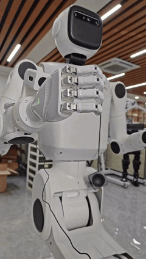

# 让机器人听得懂、看得见、说得好、走得稳、能认路、能干活

> **一个非程序员 + AI Agent，零原厂支持，两个月调通一台轮臂复合机器人的实证。**
> 一条可能的机器人应用普及路径：人类提目标与验收，Agent 读 SDK 写代码调真机；
> 运行时用「本体 skill 短路 + 本地 4B + 云端大模型」混合智脑。

  



> 🎬 完整演示视频（8 分 15 秒）见 GitHub Release 资产 `demo_full.mp4`；上方 GIF 为 2 倍速精华片段。

| | |
|---|---|
| 周期 | 2026-07-30 → 10-01（约两个月） |
| 人类 | 1 人（产品/客户角色，非程序员），代码注释留档 **135 次决策** |
| 原厂支持 | 灵龙 / 仙工开发人员零参与，仅公开资料与开放协议 |
| Agent 团队 | OpenClaw（主开发）· MiniMax-M3（云端智脑）· Codex + GLM-5.3（文档/版本/修复） |
| 硬件 | Linglong-H 轮臂复合机器人 + 仙工 AGV（Robokit 协议）+ DGX 推理服务器 |
| 前作 | 傅利叶 GR-2 上身 + 松灵 AGV 底盘轮臂（升降+俯仰电机）——经验迁移来源 |

📖 **方法论全文：[METHODOLOGY.md](METHODOLOGY.md)** —— 人机分工模型、时间线、
混合智脑决策表、安全护栏、可复制边界、迁移指南。

## 六项能力 → 技术实现

| 能力 | 实现 |
|------|------|
| 🗣 听得懂 | 端侧 VAD 完整句切分 + Qwen3-ASR + 唤醒词纠错词典 |
| 👁 看得见 | 头部摄像头拉流（VLA 建设中） |
| 💬 说得好 | Qwen3-TTS VoiceDesign + 讯飞备选 |
| 🚗 走得稳 | ±0.1 m/s 硬限速 + 三重 watchdog + 语音参数 clamp |
| 🗺 能认路 | AGV 扫图（6100/1025/2025）+ 路径导航（3051）+ 站点语音调度 |
| 🦾 能干活 | 上肢 7 动作 + 夹爪 + 关键词意图路由（不花 token 的毫秒级短路） |

## 运行时混合智脑

```
语音 → [1] 关键词 skill 短路（毫秒级，0 token）
         └→ 未命中 → [2] 本地 Qwen-4B（断网可用，0 边际成本）
                        └→ 需联网/复杂推理 → [3] 云端 MiniMax-M3（web_search）
```

每一级都有降级路径：云端失败回本地，本地失败回固定话术。

## Quick Start

```bash
pip install -r requirements.txt && sudo apt install sshpass alsa-utils
cp .env.example .env        # 填模型路径 / 主机 / MINIMAX_API_KEY

# DGX 侧（按序）
python dgx_scripts/asr_server.py            # :7780
python dgx_scripts/tts_v2_server.py         # :9003
python dgx_scripts/chassis_server.py        # :7781
python dgx_scripts/action_router_server.py  # :7793
python dgx_scripts/llm_orchestrator.py      # :7792

# 机器人侧（唯一主程序）
python dgx_scripts/linglong_voice_v3.py --device plughw:3,0 --speaker-device plughw:0,0
```

安全空跑（不碰硬件）：`ACTION_ROUTER_DRYRUN=1 python dgx_scripts/action_router.py`

## 仓库结构

```
dgx_scripts/    服务与机器人侧主程序（ASR/TTS/LLM编排/底盘/路由/SLAM）
code/           Windows 运维工具（日志转播/GUI/启动器）
skill/          Agent 操作知识库（18 篇，换机器人时照此模板重建）
hybrid_router/  混合路由（experimental，云端为 mock）
tools/          打包闸门：语法+密钥+违禁文件，FAIL 即禁打包
tests/          意图路由单测（含"下使能不得反向触发上使能"等安全回归）
METHODOLOGY.md  方法论白皮书（本仓库核心文档）
```

## 安全设计

距离 ≤2 m / 角度 ≤180° / 时长 ≤60 s 语音参数 clamp · ±0.1 m/s 硬限速 ·
watchdog 自动停 · DRYRUN 空跑 · 打包闸门与 11 项单测。
历史教训：Agent 批量替换曾改坏 6 个文件仍被打包——因此本仓库默认「不信任任何
未经闸门的产物」。

## 说明与致谢

- 安卓操控 APP（取代原厂遥操手柄/VR）在 GitHub Release 资产中下载
- 本项目为开发范式实证案例，服务绑定特定硬件，复现需同型号设备
- ⚠️ 所有服务监听 0.0.0.0 且无鉴权，仅限可信内网部署

## License

MIT — Copyright (c) 2026 Leo Yuan（廖源）& Robot-A Project Contributors
